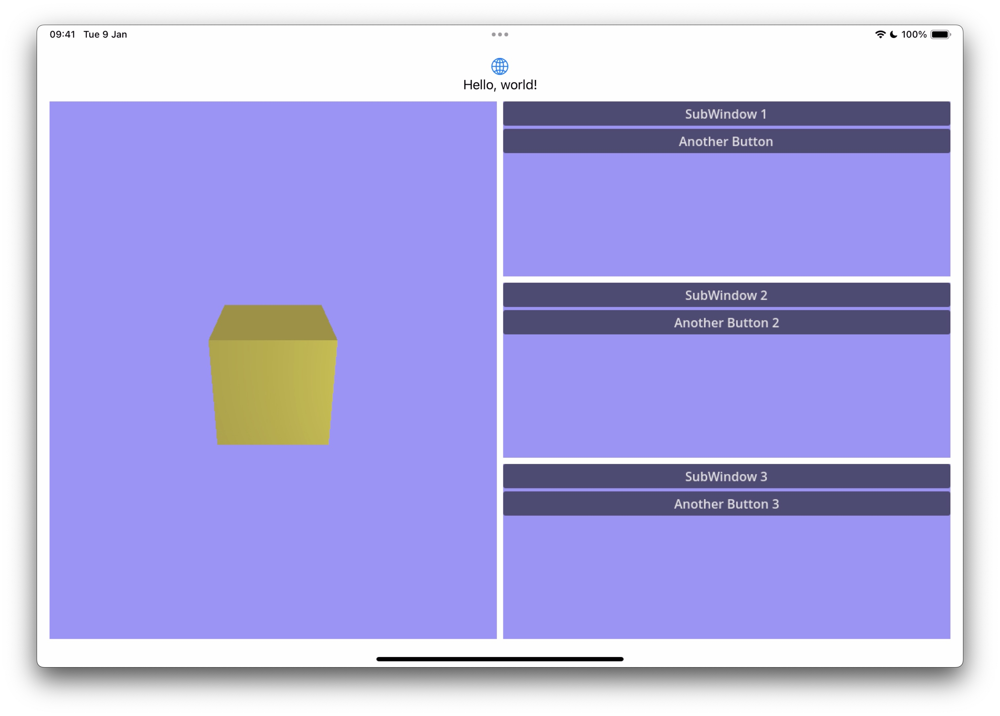

Migeran LibGodot Project
------------------------

## Features

* Compile Godot Engine as either static or shared library.
* Expose Godot Engine controls (startup, iteration, shutdown) over the GDExtension API to a host process.
* On Apple Platforms, Godot Engine windows (both the main window, and other windows created after startup) may be rendered into surfaces provided by the host process.
  * This support can be extended to other platforms, read on for details.
* Sample applications
  * C++ Sample (tested on MacOS and Linux)
  * SwiftUI Sample (tested on iOS)

## Why LibGodot?

LibGodot has a number of different use cases.
* Control Godot Engine from a host application
  * E.g. Start Godot from a .NET process to use standard .NET tooling
* Use it for automation of development tasks (e.g. building an asset pipeline using a Python GDExtension API) 
* Embed Godot into another application while displaying Godot Windows as part of the host application's UI.

## Screenshot 



This screenshot shows an iOS application displaying 4 Godot Engine Windows each laid out using SwiftUI.

## Quickstart

This repository is set up for easy testing of LibGodot.

Execute the following commands
```
git clone --recursive https://github.com/migeran/libgodot_project

cd libgodot_project

# Build for the host platform (Mac and Linux)
./build_libgodot.sh

# Build for iOS (Mac only)
./build_libgodot.sh --target ios 
```

### C++ Sample

The C++ sample shows how Godot can be controlled by a host process, by displaying its own window.

After libgodot is compiled successfully, run the following commands to test the C++ sample:

```
cd samples/cpp_sample
mkdir build
cmake -S . -B build
cd build
./sample
```

### SwiftUI Sample

To test the SwiftUI sample, just open the ios_sample project in XCode 15.1+, build it and run on any iOS device. (iOS Simulator is not supported due to Godot limitations.)

Note: You will need to select a development team in the XCode project to sign the application.

## Migeran LibGodot Design

The core idea of the LibGodot feature is to build upon Godot's strong extension capabilities: its modularity, powerful type system and the GDExtension API.

The main advantage of this approach is, that this way LibGodot may be used from any language that has a GDExtension binding (e.g. C++, Swift, Rust, Python, ... etc.), with only minimal changes to the binding.

### Godot Instance Lifecycle Management

The main class added by the LibGodot design is the GodotInstance:

```cpp
class GodotInstance : public Object {
	GDCLASS(GodotInstance, Object);

	static void _bind_methods();

	bool started = false;

public:
	GodotInstance();
	~GodotInstance();

	bool start();
	bool is_started();
	bool iteration();
	void shutdown();
};
```

This class is made accessible over the GDExtension API. This class can be used to control a Godot instance.

To actually create a Godot instance a new symbol is added to the GDExtension API:

```cpp
GDExtensionObjectPtr gdextension_create_godot_instance(int p_argc, char *p_argv[], GDExtensionInitializationFunction p_init_func);
```

This function can be used to create a new Godot instance and return a GodotInstance object reference to control it. Both samples show how easy it is to bind this function and then use the generated GDExtension API bindings with the returned GodotInstance object.

To properly destroy a Godot instance the GDExtension API is extended by another symbol:

```cpp
typedef void (*GDExtensionInterfaceDestroyGodotInstance)(GDExtensionObjectPtr p_godot_instance);
```

This function is made available through the GDExtension API's getProcAddress mechanism.

Note: Due to Godot's internal architecture (the use of global data structures and singletons) only one Godot instance may be created in a process.

### Embedding Godot UI

Note: UI embedding is currently implemented for Apple platforms. Please read the [Next Steps](#next-steps) section for more information on the status of other platforms. 

To allow for embedding the Godot UI into a host process the host process needs to be able to pass the necessary data about a native surface where 
Godot may render its contents. The form of this native surface is entirely platform and rendering backend specific.

The Migeran LibGodot design adds the following types to Godot to allow this:

* A new ``DisplayServerEmbedded`` implementation which uses externally provided native surfaces as its rendering targets.
* A ``RenderingNativeSurface`` class and its associated platform specific subclasses, e.g. ``RenderingNativeSurfaceApple``.
* The ``Window`` class is extended by a ``set_native_surface(Ref<RenderingNativeSurface>)`` method which allows specifying the rendering target of a Window in a typesafe, platform independent manner. It is even possible to change the rendering target of a Window dynamically during its lifecycle. 

These classes are all exposed to the GDExtension API, so it is easy to use them from the host process.

The ``DisplayServerEmbedded`` class also exposes methods that allow the injection of input events from the host process into the Godot instance.

The RenderingNativeSurface class hierarchy has an additional function: provides a mechanism using the **Factory Method** design pattern to create compatible RenderingContextDrivers for a native surface.

This allowed us to make the ``DisplayServerEmbedded`` class platform agnostic.

We also refactored the other ``DisplayServer`` implementations to use ``RenderingNativeSurface`` during initialization.

Since all these classes are exposed over the GDExtension API, these can be seamlessly used from any supported language with a GDExtension binding.

### Rationale for RenderingNativeSurface Design

For those who are familiar with Godot Engine internals: there was already a way to pass in platform specific native surface data (called ``WindowPlatformData``) during initialization.

Why is this refactoring necessary to a full fledged reference counted object?

* We chose reference counting because it makes it easier to use on the client side, no need to manage the lifecycle manually. Earlier versions of this PR used simple Godot Objects, but they required manual memory management which was error prone.

* While on Apple platforms it is very easy to pass in a ``CAMetalLayer`` reference, and Metal (and thus MoltenVk) will happily render into it, other platforms impose way more restrictions.
  * For example: On Windows and Linux a separate Vulkan instance and the use of external textures is required to render Godot on a separate thread from the host application's main renderer thread.
  
  * This is not just a theoretical option: We already implemented a prototype on Linux and Windows based on Godot 4.2, where the host process and Godot are using Vulkan External Textures to pass the rendered frames from Godot to the host process. We intend to upgrade and refactor this patch to the current version of the LibGodot patch.
  
  * To use External Textures a thread-safe queue has to be implemented between between the host process and Godot, and a reference-counted RenderingNativeSurface subclass would be an ideal place to implement it, e.g. ``RenderingNativeSurfaceVulkanExternalTextureWin32``.

## Next Steps

### Open for Discussion

We are happy to discuss any part of the design, naming conventions, additional features ... etc.

### Merging for Godot 4.3 as an Experimental Feature

* We propose to merge the current LibGodot patch as an experimental feature in Godot 4.3, because it is already very usable in its current form for many use cases.

### Godot 4.4 Developments

During the Godot 4.4 development cycle additional features may be added, for Example:

* Support for additional platforms for UI embedding: Android, Windows, Linux (both X11 and Wayland).
* Support for OpenGL (Native / ANGLE) UI embedding on all platforms.
* Add a Configuration API that can be used on startup instead of supplying command line parameters. 

## Sponsors & Acknowledgements

* Initial development sponsored by [Smirk Software](https://www.smirk.gg/)
* Rebasing to Godot 4.3 and further development sponsored by [Xibbon Inc.](https://xibbon.com)

* The GDExtension registration of the host process & build system changes were based on @Faolan-Rad's LibGodot PR: https://github.com/godotengine/godot/pull/72883

## About the Authors

This feature was implemented by [Migeran - Godot Engine & Robotics Experts](https://migeran.com).

We are available for new software development projects in Robotics, Godot Engine, AR/VR and other domains. If you have any questions, you may [contact us through our website](https://migeran.com/contact).

